# L I G H T H O U S E
### 001 // DIGITAL LANDSCAPE ENGINE

**An immersive maritime environment crafted with WebGL & React Three Fiber.**

[ [LAUNCH EXPERIENCE](https://lighthouse.sujitkoji.com/) ] &nbsp; • &nbsp; [ [RESOURCES](https://github.com/sujitkoji/lighthouse) ]

 

---

### / VISION

**LightHouse** is a cinematic WebGL experiment focused on **atmosphere, scale, and motion**.  
The project simulates a stormy maritime scene where **ocean dynamics, volumetric clouds, lightning, and lighting choreography** work together to create a believable digital landscape — entirely inside the browser.

Every system is designed to run **GPU-first**, keeping React out of the render loop while maintaining declarative structure.

---

### / CORE SYSTEMS

<table width="100%">
  <tr>
    <td width="33%" align="center" style="border: none;">
      <code>[ 01. HYDROS ]</code>  
      <b>Custom Ocean Surface</b> 
      <i>Shader-driven water + caustics</i>
    </td>
    <td width="33%" align="center" style="border: none;">
      <code>[ 02. ATMOS ]</code>  
      <b>Dynamic Sky & Clouds</b> 
      <i>Volumetric + instanced motion</i>
    </td>
    <td width="33%" align="center" style="border: none;">
      <code>[ 03. SIGNAL ]</code>  
      <b>Lighthouse & Signal</b> 
      <i>Rotating beam + stochastic flashes</i>
    </td>
  </tr>
</table>

---

### / SYSTEM DESIGN NOTES

#### // OCEAN SIMULATION
The ocean is built using `three-stdlib`’s **Water** shader, extended via `onBeforeCompile` to introduce **animated caustics**. Wave motion is driven by time-based uniforms.

$$y = A \cdot \sin(\omega t + \phi)$$

#### // LIGHT & WEATHER
- **Lightning:** Probabilistic point-light system with temporal decay.
- **Lighthouse beam:** Spotlight with high penumbra for cinematic softness.

---

### / PERFORMANCE STRATEGY

`IMPERATIVE UPDATES` • `DPR CLAMPING` • `GLTF OPTIMIZATION` • `SUSPENSE PIPELINE`

---

### / PROJECT STRUCTURE

<table align="center" style="border-collapse: collapse; border: none;">
<tr>
<td align="left" style="background-color: #0d1117; border: 1px solid #30363d; border-radius: 12px; padding: 30px;">
<pre style="margin: 0; font-family: 'JetBrains Mono', 'Fira Code', monospace; line-height: 1.6; color: #c9d1d9; background: none; border: none;">
app/
 ├─ lighthouse/
 │  ├─ scene.tsx          // Main R3F canvas
 │  ├─ ocean.tsx          // Water + shader extensions
 │  ├─ MovingClouds.tsx   // Volumetric cloud system
 │  ├─ Lightning.tsx      // Lightning flashes
 │  └─ lighthouseGLB.tsx  // Lighthouse model & beam
 │
 └─ Loader/
    └─ loader.tsx         // Cinematic loading screen
</pre>
</td>
</tr>
</table>

---

### / ARCHITECTURE

```mermaid
graph LR
    A[Canvas] --> B[Sky & Fog]
    A --> C[Ocean Shader]
    A --> D[Cloud System]
    A --> E[Lighthouse]
    E --> F[Rotating Beam]
    E --> G[Warm Glow]
    A --> H[Lightning System]
    style A fill:#111,stroke:#58a6ff,stroke-width:2px
    style E fill:#111,stroke:#8b949e,stroke-width:2px
```

### / LICENSE & USAGE

This project is a **Technical Study** and is intended for **Educational Purposes** only. 

- **[ 01. LOGIC ]** The source code is licensed under the [MIT License](LICENSE). You are free to explore, fork, and adapt the engine for your own experiments.
- **[ 02. ASSETS ]** The 3D models, textures, and environment maps remain the intellectual property of their respective creators. No commercial usage is permitted for the assets contained within this repository.
- **[ 03. ATTRIBUTION ]** This is a non-commercial laboratory. If the shader logic or atmospheric systems are integrated into your projects, a credit back to **Sujit Koji** is required to maintain the spirit of open-source authorship.

---

### / ARCHITECTURE AUTHORSHIP

**SUJIT KOJI** Creative Technologist & WebGL Architect [ [PORTFOLIO](https://sujitkoji.com) ] &nbsp; / &nbsp; [ [LINKEDIN](https://www.linkedin.com/in/sujitkoji/) ]

© 2026 - Open Source Creative Experiment

