# L I Q U I D _ V O I D
### 001 // GPGPU MORPHOLOGY ENGINE

**An abstract generative fluid simulation crafted with GLSL & React Three Fiber.**

[ [LAUNCH EXPERIENCE](https://liquid-void.sujitkoji.com/) ] &nbsp; • &nbsp; [ [RESOURCES](https://github.com/sujitkoji/liquid-void) ]

 

 

---

### / VISION

**Liquid Void** is a high-end WebGL experiment focused on **organic motion, refractive aesthetics, and mathematical beauty**. 
The project explores the intersection of **Simplex Noise algorithms** and **Fresnel equations** to simulate a volatile, liquid-like core trapped in a digital vacuum.

Every system is built with a **Performance-First** mindset, utilizing custom shaders to handle complex vertex displacement directly on the GPU.

---

### / CORE ARCHITECTURE

<table width="100%">
  <tr>
    <td width="33%" align="center" style="border: none;">
      <code>[ 01. VERTEX ]</code>  
      <b>Simplex Distortion</b> 
      <i>Dynamic noise-based displacement</i>
    </td>
    <td width="33%" align="center" style="border: none;">
      <code>[ 02. FRAGMENT ]</code>  
      <b>Fresnel Shading</b> 
      <i>View-dependent light reflection</i>
    </td>
    <td width="33%" align="center" style="border: none;">
      <code>[ 03. OPTICS ]</code>  
      <b>Post-Processing</b> 
      <i>Cinematic Bloom & Film Grain</i>
    </td>
  </tr>
</table>

---

### / TECHNICAL SPECIFICATIONS

#### // NOISE MORPHOLOGY
The mesh utilizes **3D Simplex Noise** to calculate real-time vertex displacement. Unlike standard Perlin noise, Simplex provides a more organic, non-directional flow with lower computational overhead.

$$P_{new} = P_{old} + \vec{n} \cdot \text{Snoise}(P_{old} \cdot \omega + t) \cdot A$$

#### // FRESNEL APPROXIMATION
To achieve the "premium" liquid look, we implement a custom Fresnel effect in the fragment shader. This calculates the reflectance based on the angle between the view vector and the surface normal.

$$F = \max(0.0, 1.0 - \vec{V} \cdot \vec{N})^{power}$$

---

### / PERFORMANCE STRATEGY

`GPU INSTANCING` • `DPR CLAMPING` • `MEMOIZED UNIFORMS` • `LERP INTERPOLATION`

---

### / PROJECT STRUCTURE

<table align="center" style="border-collapse: collapse; border: none;">
<tr>
<td align="left" style="background-color: #0d1117; border: 1px solid #30363d; border-radius: 12px; padding: 30px;">
<pre style="margin: 0; font-family: 'JetBrains Mono', 'Fira Code', monospace; line-height: 1.6; color: #c9d1d9; background: none; border: none;">
src/
 ├─ LiquidVoid/
 │  ├─ scene.tsx         // R3F Canvas & Post-Process
 │  ├─ LiquidCore.tsx    // Shader Logic & Uniform Updates
 │  ├─ Overlay.tsx       // Cinematic HUD Overlay
 │  └─ shaders/
 │     ├─ vertex.glsl    // Displacement logic
 │     └─ fragment.glsl  // Color & Fresnel math
 │
 └─ hooks/
    └─ useLerp.ts        // Smooth interaction transitions
</pre>
</td>
</tr>
</table>

---

### / SYSTEM DESIGN

```mermaid
graph TD
    A[Leva Controls] -->|Uniforms| B[LiquidCore]
    B --> C[Vertex Shader: Noise]
    B --> D[Fragment Shader: Fresnel]
    C --> E[Geometry Displacement]
    D --> F[Color Composition]
    E & F --> G[EffectComposer]
    G --> H[Final Output: Bloom/Grain]
    style B fill:#111,stroke:#FF0055,stroke-width:2px
    style G fill:#111,stroke:#58a6ff,stroke-width:2px
```

### / ARCHITECTURE AUTHORSHIP

**SUJIT KOJI** Creative Technologist & WebGL Architect [ [PORTFOLIO](https://sujitkoji.com) ] &nbsp; / &nbsp; [ [LINKEDIN](https://www.linkedin.com/in/sujitkoji/) ]

© 2026 - Open Source Creative Experiment

#
